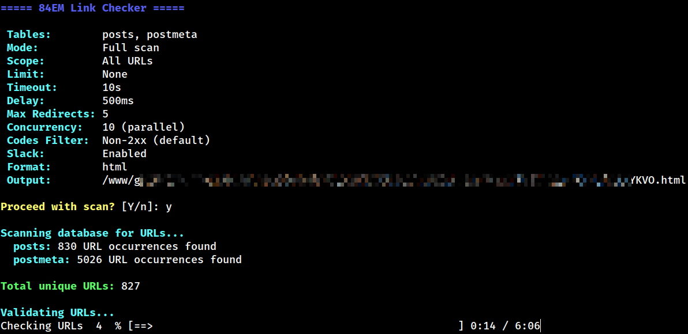
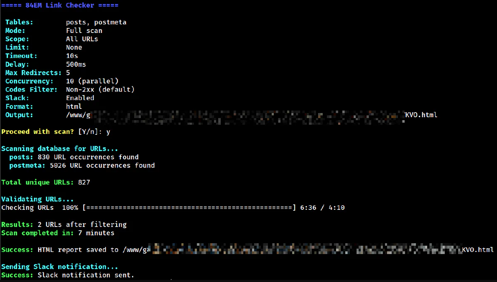
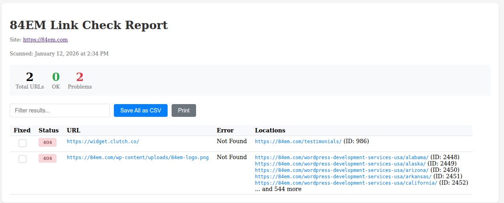
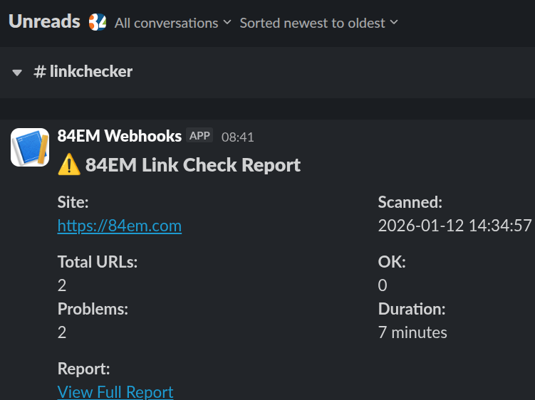

Broken links are inevitable. Content gets removed, domains expire, URLs change. The question is whether you find them before your visitors do.

Most WordPress link checking solutions fall into two categories: plugins that run on every page load (slow) or external services that crawl your site. Neither approach is ideal.

Crawlers have to render every page. That means bootstrapping WordPress, loading your theme, executing page builder logic, and generating HTML for each URL. On a site with thousands of pages, that's significant server load. Worse, security plugins like Wordfence or Sucuri often rate-limit or outright block crawlers, even when they're yours.

I needed something different: a command-line tool that queries the database directly, runs on demand or on a scheduled cron job, and never triggers your firewall.

## Why Database Queries Beat Crawling

A crawler treats your site like a visitor would: request a page, wait for the response, parse the HTML, find links, repeat. Every request means PHP execution, database queries for the content, theme rendering, and page builder processing.

A direct database scan skips all of that. It reads the `posts` and `postmeta` tables directly, extracts URLs from the stored content, and checks them against external servers. Your WordPress stack never runs except for the initial WP-CLI bootstrap.

The practical benefits:

**No server load**: Checking 5,000 URLs doesn't mean rendering 5,000 pages. Your production site stays fast for actual visitors.

**No firewall conflicts**: Security plugins can't block what isn't an HTTP request to your site. The scan runs inside your server, not against it.

**Works anywhere**: Staging sites behind HTTP auth, local development environments, password-protected pre-launch sites. If WP-CLI can connect to the database, the scan works.

**Runs on your schedule**: No background process consuming resources during peak hours. Run it at 3 AM via cron, or manually when you need it.

## How It Works

The tool is a WP-CLI command that runs in three phases:

### Extraction

It scans the `posts` and `postmeta` tables in batches, extracting URLs from:

- Plain text content
- JSON strings (escaped or unescaped)
- Serialized PHP arrays
- HTML attributes

URLs are normalized for deduplication. `https://example.com` and `https://example.com/` become the same entry. Query parameters are sorted alphabetically so `?a=1&b=2` matches `?b=2&a=1`.

### Validation

Each URL gets an HTTP HEAD request. If the server rejects HEAD (some do), it falls back to a GET request with a Range header to minimize bandwidth.

The validator follows redirects manually rather than relying on cURL's built-in redirect handling. This lets it detect redirect loops and chains, reporting exactly where things go wrong.

Requests run in parallel using `curl_multi` with configurable concurrency. Ten simultaneous connections is the default, but you can dial it up or down based on your server's capacity and how polite you want to be to external sites.

Per-domain rate limiting prevents hammering any single server. The default is 500ms between requests to the same host.



### Reporting

Results export to four formats:

- **Table**: Quick terminal output for small scans
- **CSV**: For spreadsheet analysis or importing into other tools
- **JSON**: For programmatic processing
- **HTML**: An interactive report with filtering, sorting, and persistent "fixed" checkboxes

The HTML report is the default. It saves to `wp-content/uploads/panacea-link-check/` with a random filename and displays a summary with problem counts.



## Smart Filtering

Not every URL needs checking.

### Default Skips

- Localhost and private IP ranges (127.0.0.1, 10.x.x.x, 192.168.x.x)
- Non-HTTP protocols (mailto:, tel:, javascript:, data:)

### Custom Filters

You can add your own filters for domains that don't return useful results:

- WordPress.org (rate limits aggressively)
- Social media platforms (block automated requests)
- Government sites (often have strict bot policies)
- Common CDNs and schema definition URLs

External URLs only report 404 errors by default. A 403 from Twitter or a 429 from YouTube is not actionable. Internal 404s, however, indicate actual problems you can fix.

## Usage Examples

Basic scan with HTML report:

```
wp 84em linkcheck
```

Dry run to see what URLs would be checked:

```
wp 84em linkcheck --dry-run
```

Check only internal links:

```
wp 84em linkcheck --skip-external
```

Limit to 100 URLs for testing:

```
wp 84em linkcheck --limit=100
```

Output as JSON with no Slack notification:

```
wp 84em linkcheck --format=json --no-slack
```

Aggressive parallel checking (15 connections):

```
wp 84em linkcheck --concurrency=15
```

Sequential checking with shorter delay:

```
wp 84em linkcheck --concurrency=1 --delay=200
```

## The Interactive HTML Report

Here's an [example HTML report](https://gist.github.com/84em/d9c5592afb2ba57bd2cba9a3eb5da508) from an actual scan.



The HTML report includes features that make triage practical:

**Filtering**: Type in the search box to filter results by URL, status code, or error message.

**Sorting**: Click column headers to sort by status, URL, or error type.

**Fixed Checkboxes**: Mark links as fixed. State persists in localStorage, so you can close the browser and come back later. This is useful when working through a long list over multiple sessions.

**Export**: Save all results or just the filtered view as CSV.

## Slack Integration

Define a webhook URL in your credentials file:

```php
define( 'EIGHTYFOUREM_SLACK_LINKCHECK_WEBHOOK', 'https://hooks.slack.com/services/...' );
```

The tool sends a summary notification after each scan with total URLs checked, problem count, and a link to the HTML report. Disable it for a single run with `--no-slack`.



## Configuration Options

| Option | Default | Description |
|--------|---------|-------------|
| `--timeout` | 10 | Seconds before a request times out |
| `--delay` | 500 | Milliseconds between requests to the same domain |
| `--max-redirects` | 5 | Maximum redirect chain length |
| `--concurrency` | 10 | Parallel HTTP connections |
| `--batch-size` | 1000 | Database rows per query batch |
| `--tables` | posts,postmeta | Which tables to scan |

## Edge Cases Handled

**Redirect loops**: Detected and reported rather than hanging forever.

**Relative URLs in redirects**: Resolved against the original URL.

**Servers that reject HEAD requests**: Automatic fallback to GET with Range header.

**Internationalized domain names**: Converted to ASCII for validation.

**URLs with credentials**: Stripped from output for security.

**Serialized PHP in postmeta**: Unserialized and scanned recursively.

**Elementor JSON**: Escaped slashes unescaped before URL extraction.

## Performance

A site with 500 published pages and posts typically has 2,000 to 5,000 unique URLs after deduplication. With default settings (10 concurrent connections, 500ms delay), a full scan takes 10 to 20 minutes.

Memory usage stays low because the database scan uses generators. Only the current batch is in memory at any time.

## Installation

The tool is a must-use plugin. Drop it in `wp-content/mu-plugins/` and it loads automatically. No activation required.

Dependencies:

- PHP 8.0 or higher (uses named arguments and union types)
- WP-CLI
- cURL extension with `curl_multi` support

Source code is available as a [GitHub Gist](https://gist.github.com/84em/742967dee62b484a1857829c04ca9e14). Comments, feedback, and critique welcome. If there's enough interest, I'll move it to a proper repository for pull requests.

## When to Run It

Schedule a weekly or monthly scan via cron. The Slack integration makes it easy to get notified without logging into the server.

Run it after major content migrations, domain changes, or redesigns. These events tend to create broken links in bulk.

Run it before launching a new site. Broken links on day one are embarrassing.

## What It Does Not Do

This tool finds broken links. It does not fix them. Review the report, decide what to do with each broken link, and make changes manually or with a tool designed for that purpose.

It also does not check links in navigation menus, widget areas, or theme files. Those are on the roadmap. The database scan currently focuses on content authored through the WordPress editor and page builders.
